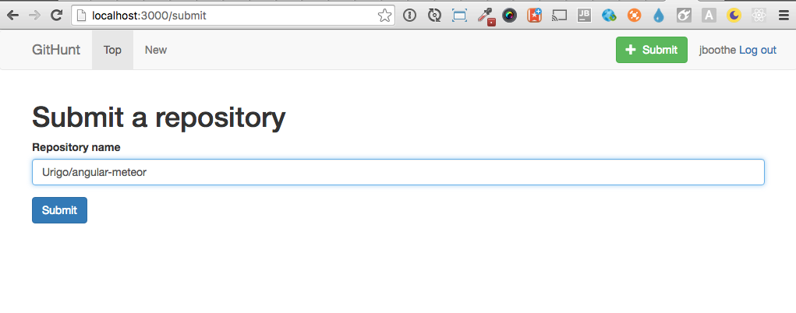
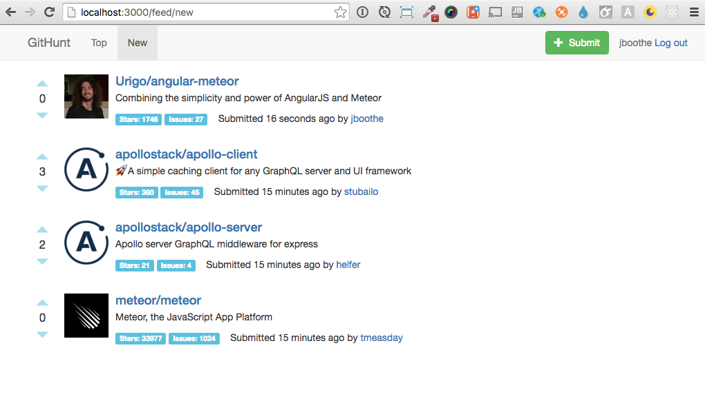

# GitHunt React

An example of a client-side app built with React and Apollo Client.

See the application running live at [http://www.githunt.com](http://www.githunt.com).

[](http://www.apollostack.com/#slack)
[](https://travis-ci.org/apollostack/GitHunt-React)

Please submit a pull request if you see anything that can be improved!

## Running the app

### 1. Clone and run the GitHunt API

This repository is only the React frontend. Run the [GitHunt API](https://github.com/apollostack/GitHunt-API) first. (This is temporary, until we have a permanently hosted demo server.)

### 2. Install Node/npm

Make sure you have Node.js installed (the app has been tested with Node `4.4.5` and `5.3.0`)

### 3. Clone and install dependencies

```
git clone https://github.com/apollostack/GitHunt-React.git
cd GitHunt-React
npm install
```

### 4. Update config file
Go to the folder `ui` and update the file `config.js` 
where you'll be able to find two options: `persistedQueries` and `wsTransportType`.

`persistedQueries` allow you to set if you want to use `extractgql` to generate persisted queries (more 
info inside config file.). 

`wsTransportType` allow you to set your desired websocket transport type. It can be `full` for full ws transport 
mode (queries, mutations and subscriptions sent over websocket) or `hybrid` for hybrid ws 
transport mode (queries and mutations sent over http and subscriptions sent over websocket).

### 5. Run the app

```
npm run dev
```

- Open the client at http://localhost:3000
- Click "Log in with GitHub" in the upper right corner
- You'll be presented with the seed items in the app


#### Submit a Repo
Click the green Submit button and add repo with the username/repo-name pattern.



#### New Item
Review the new item, up vote it and visit the repo via the link.
