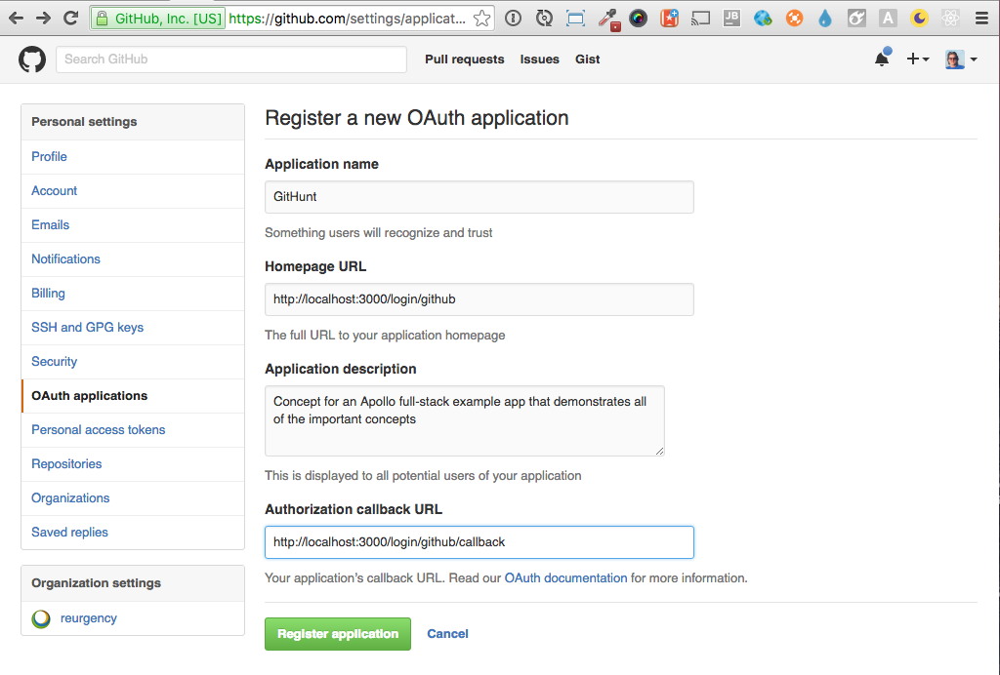
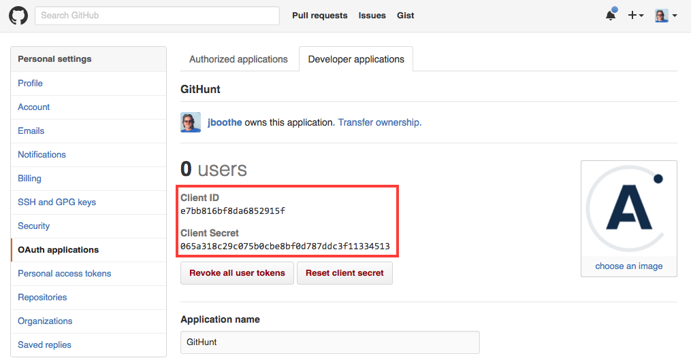
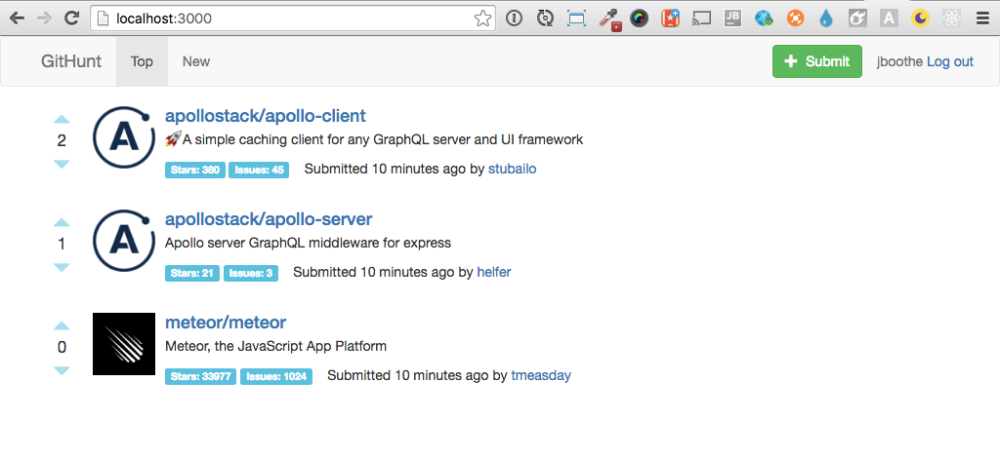
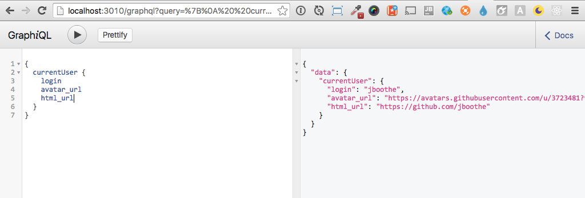

# GitHunt

A full-stack Apollo Client and Server example app.

[](http://www.apollostack.com/#slack)
[](https://travis-ci.org/apollostack/GitHunt)

Demonstrates:

1. GraphQL schema, resolvers, models, and connectors to read from two different data sources, GitHub REST API and SQL
2. Web server with authentication and basic authorization using Express, Passport, and Apollo Server
3. React app with React Router and Apollo Client that displays data and does some writes

As Apollo Client and Server gain more features, we'll add them to this app. Please submit a pull request if you see anything that can be improved!

## Running the app

### 1. Install Node/npm

Make sure you have Node.js installed (the app has been tested with Node `4.4.5` and `5.3.0`)

### 2. Clone and install dependencies

```
git clone https://github.com/apollostack/GitHunt.git
cd GitHunt
npm install
```

### 3. Run Migrations

Set up the SQLite database and run migrations/seed data with the following commands:

```
npm run migrate
npm run seed
```

### 4. Get GitHub API keys

- Go to [OAuth applications > Developer applications](https://github.com/settings/developers) in GitHub settings
- Click 'Register a new application' button
- Register your application like below
- Click 'Register application' button



On the following page, grab:

- Client ID
- Client Secret



### 5. Add Environment Variables
Set your Client ID and Client Secret Environment variables:

```
export GITHUB_CLIENT_ID="your Client ID"
export GITHUB_CLIENT_SECRET="your Client Secret"
```

Or you can use `dotenv`.

`cp .env.default .env` and edit with your Github keys.

### 6. Run the app

```
npm start
```

- Open the client at http://localhost:3000
- Click "Log in with GitHub" in the upper right corner
- You'll be presented with the seed items in the app



#### Submit a Repo
Click the green Submit button and add repo with the username/repo-name pattern.


#### New Item
Review the new item, up vote it and visit the repo via the link.   


#### Apollo Server

The server will run on port 3010, but the Webpack dev server proxies it to 3000. You can access the server's GraphiQL UI at <http://localhost:3000/graphiql>.



## Code patterns to demonstrate

1. Routes and data loading
1. Server side rendering and store hydration
1. Merging data from multiple backends/APIs
1. Authentication and basic security
1. Mutations - updating and inserting items
1. Developer tool integrations, like `eslint-plugin-graphql`
1. One place where there is reactivity/streaming data (nice to have)

As new patterns emerge in Apollo development, we should add them to this app.

## App concept

GitHunt - like product hunt for GitHub repositories.

There are three views:

1. The home page feed, which is a ranked list of repositories
1. A page to submit a new repository
1. A repository page, with comments

Does it demonstrate all of the required features above?

- [x] Routes and data loading? Yes, it has multiple pages which require different data.
- [x] SSR/hydration? Yes, the front page should load fast.
- [x] Merging data? Yes, this will merge upvote and comment data from a local database with repository information from GitHub.
- [x] Auth and basic security? Yes, it will have GitHub login, and security so that people can only post comments when logged in, and everyone can only vote once per repo.
- [x] Mutations: Submitting a new repo, voting, and commenting.
- [x] Dev tools: Yes
- [x] Reactivity: we can reactively update the vote count on the repository page via a websocket or poll.

## Technology choices

- Apollo server - to put a nice unified API on top of our GitHub and local data
- Apollo client - to load that data declaratively into our UI
- React - it's a great way to build UIs, and has the best integration with Apollo and Redux
- React router - it seems to be the most popular React router today, and has some great hooks and techniques for SSR. It seems like James Baxley has had some success with implementing this stuff already with React Router.
- Webpack - the Meteor build system is by far the most convenient, but comes with a dependency on mongo, its own account system, etc. Since we want to learn how Apollo works without all of these things, we're going to not use it even though it would reduce the complexity of the code.
- Babel - to compile our server code.
- Redux - to manage client side data, perhaps we can also use Redux Form to manage the submission form, but we'll see when we get there.
- Passport.js for login - this seems to be the most common login solution for Express/Node, and has a great GitHub login solution. Jonas has already written a tutorial for using that with GraphQL.
- SQL for local data - We'll use SQLite for dev, and Postgres for production. TBD - should we use Sequelize or some other ORM? Or just Knex for query building?
- Bootstrap for styling - I already know how to use it, and I don't want the styling to be the focus of the app. Let's keep it as simple as possible.
